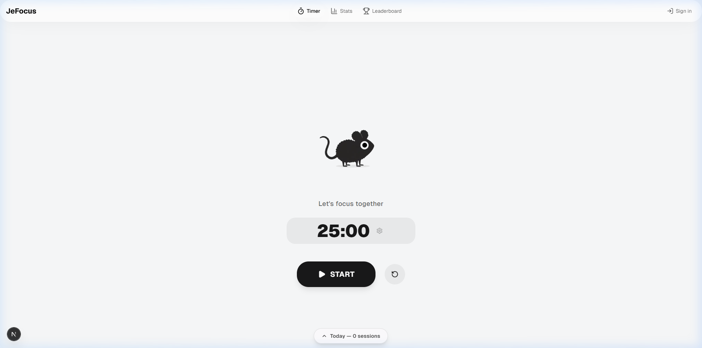

# 🐭 JerryPomo: Focus with Aura



A premium, interactive Pomodoro timer designed for modern focus. **JerryPomo** transforms the standard focus timer into an emotionally engaging experience featuring a living mascot, premium aesthetic, and intelligent tracking.

## ✨ Features

- **Obsidian Aura Design System**: A sleek, minimalism-focused dark theme with advanced glassmorphism, soft ambient glows, and tactile micro-interactions.
- **Interactive Mascot (Jerry)**: A 5-stage animated mouse mascot that reacts to your progress. Watch Jerry grow and celebrate your milestones with you.
- **Daily Focus Tracking**: Visualized progress through a dynamic "Bottom Sheet" tracker. Monitor your sessions, daily targets, and focus history at a glance.
- **Multi-Channel Ambient Mixer**: Craft your perfect workspace with customizable ambient sound layers (Rain, Coffee Shop, Forest, White Noise).
- **Intelligent Timer & Presets**: Optimized presets for 'Deep Work', 'Quick Session', and 'Custom' focus blocks.
- **Progressive Web App (PWA)**: Fully installable on all devices with offline support and system-level notifications.

## 🛠️ Technology Stack

- **Framework**: Next.js 16 (App Router)
- **State Management**: Zustand (Client) + tRPC (API)
- **Database**: Prisma + PostgreSQL (Supabase/Local)
- **Animations**: Framer Motion + CSS Transitions
- **Audio Logic**: Howler.js
- **Styling**: Tailwind CSS 4.0 (Custom Glass System)
- **Auth**: NextAuth.js (Google & GitHub)
- **PWA**: `next-pwa` with custom service worker caching

## 🚀 Getting Started

1. **Clone & Install**:
   ```bash
   git clone https://github.com/phantranthelinh/pomodro.git
   cd pomodro
   npm install
   ```

2. **Environment Setup**:
   Create a `.env` file with your `DATABASE_URL`, `NEXTAUTH_SECRET`, and OAuth credentials.

3. **Run Development**:
   ```bash
   npm run dev
   ```

4. **Build for Production**:
   ```bash
   npm run build
   npm start
   ```

## 📐 Design Philosophy

JerryPomo follows the **Obsidian Aura** design principles:
- **Calmness**: Neutral backgrounds with soft, high-contrast typography.
- **Feedback**: Every action has a subtle, high-quality animation.
- **Engagement**: The mascot provides a sense of companionship during long focus sessions.

---

Built with ❤️ by [Phan Tran The Linh](https://github.com/phantranthelinh)
